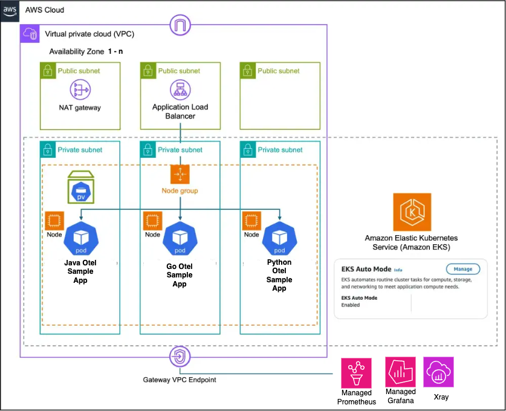
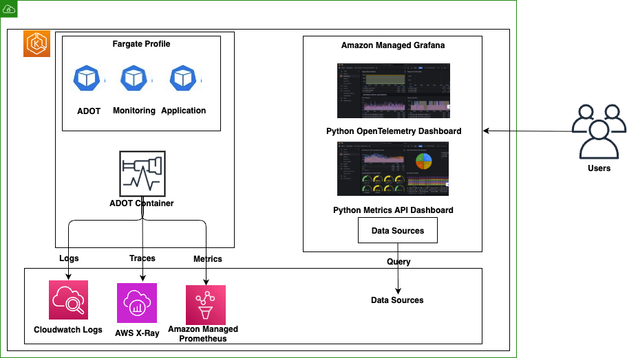
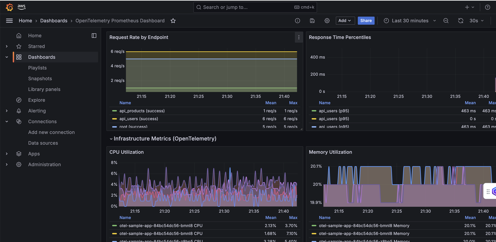
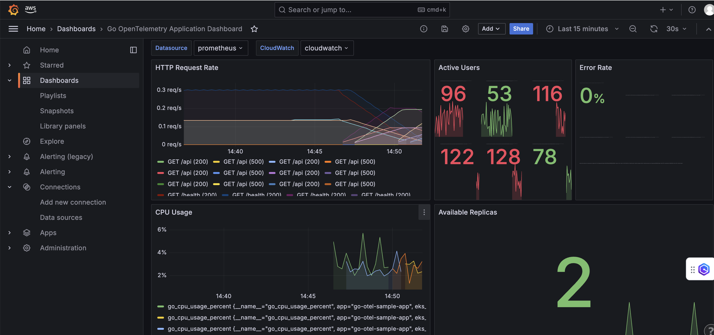
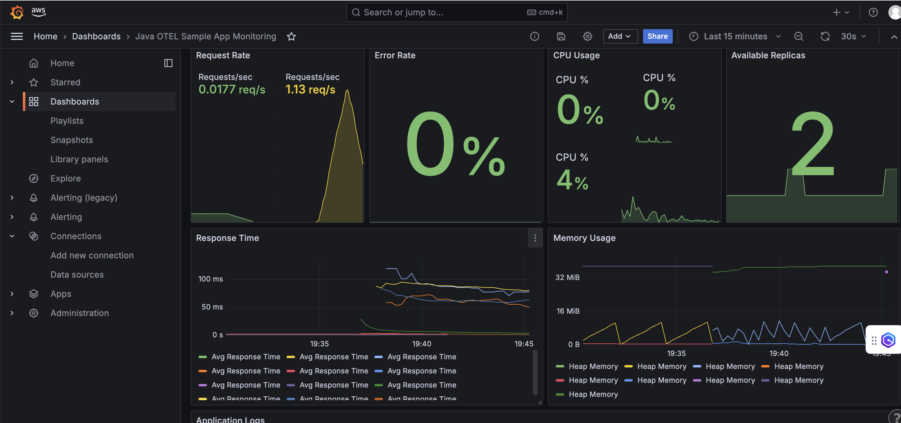
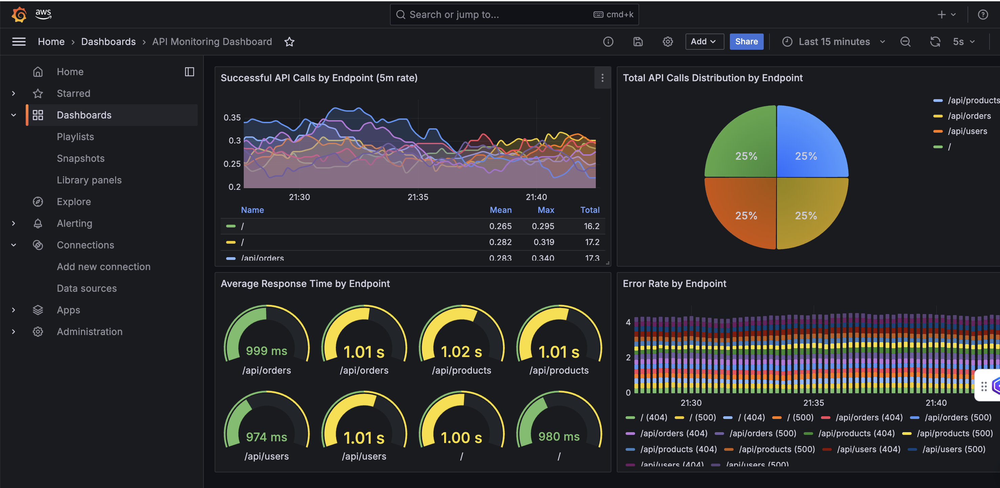
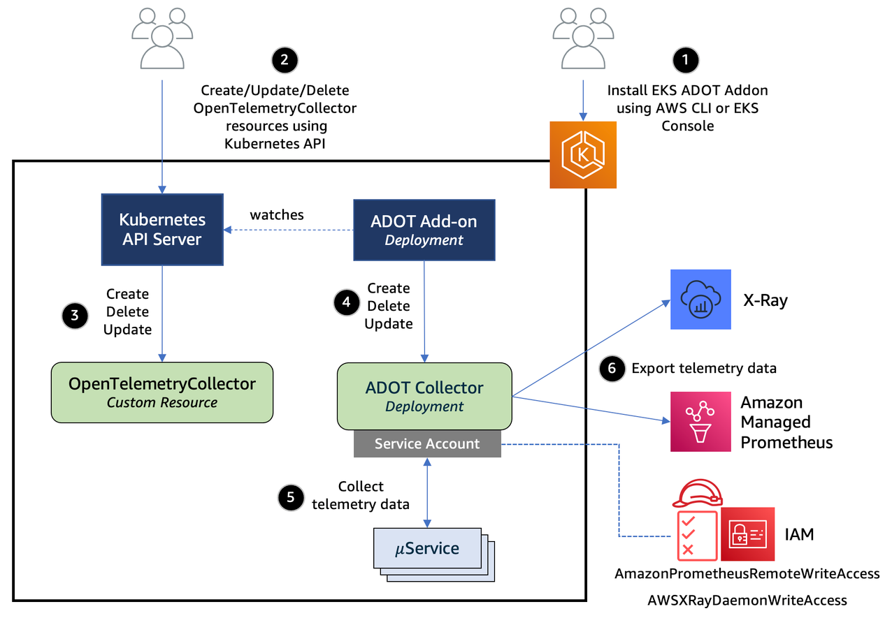
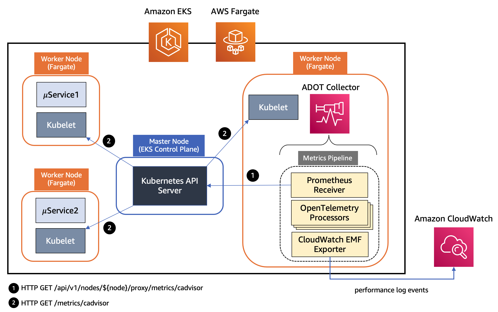

# EKS Platform with Comprehensive Observability

This project demonstrates how to deploy an Amazon EKS cluster with **flexible compute options** (Fargate or Auto Mode), auto-scaling, and a complete observability solution using AWS native services and OpenTelemetry.


## Architecture Overview

This solution implements a fully managed Kubernetes environment on AWS with:

- **Amazon EKS** with flexible compute options:
  - **EKS Auto Mode** for automatic compute provisioning and management
  - **AWS Fargate** for serverless container orchestration
- Complete observability pipeline with:
  - Amazon Managed Service for Prometheus (AMP) for metrics
  - AWS X-Ray for distributed tracing
  - Amazon CloudWatch for logs
  - AWS Distro for OpenTelemetry (ADOT) for data collection
- **Real metrics-based HPA**: All applications use actual Prometheus metrics for auto-scaling

The architecture follows AWS best practices for security, scalability, and observability.

## 🔄 **Compute Options**

### **EKS Auto Mode** (Recommended for most workloads)
- **Automatic Compute Management**: No need to manage node groups or Fargate profiles
- **Built-in Auto Scaling**: Automatically scales compute resources based on workload demands
- **Integrated Networking**: Automatic VPC CNI and load balancer configuration
- **Storage Integration**: Built-in EBS CSI driver for persistent storage
- **Cost Optimization**: Pay only for the compute resources your workloads use
- **Cluster Name**: `dev-eks-automode`

### **AWS Fargate** (Serverless containers)
- **Serverless Containers**: No EC2 instances to manage
- **Per-Pod Billing**: Pay only for the vCPU and memory resources used by pods
- **Automatic Scaling**: Pods scale automatically without capacity planning
- **Security Isolation**: Each pod runs in its own compute environment
- **Cluster Name**: `dev-eks-fargate`
- **Fargate Profiles**: Automatically created for `default`, `monitoring`, `opentelemetry`, and `kube-system` namespaces

### **Key Differences**

| Feature | EKS Auto Mode | AWS Fargate |
|---------|---------------|-------------|
| **Node Management** | Fully automated | Serverless (no nodes) |
| **Scaling** | Automatic based on demand | Per-pod scaling |
| **Networking** | Shared node networking | Isolated pod networking |
| **DNS Configuration** | Standard cluster DNS | Requires `dnsPolicy: ClusterFirst` |
| **IRSA Setup** | Standard service accounts | Requires explicit AWS credential env vars |
| **Cost Model** | Pay for actual compute usage | Pay per pod vCPU/memory |
| **Use Case** | General workloads, cost-optimized | Security-sensitive, isolated workloads |

## Infrastructure Components

#### Service Roles
- **Cluster Service Role**: EKS cluster management with Auto Mode policies
  - `AmazonEKSClusterPolicy`
  - `AmazonEKSComputePolicy`
  - `AmazonEKSBlockStoragePolicy`
  - `AmazonEKSLoadBalancingPolicy`
  - `AmazonEKSNetworkingPolicy`

- **Node Group Service Role**: EC2 compute resources for Auto Mode
  - `AmazonEKSWorkerNodePolicy`
  - `AmazonEKS_CNI_Policy`
  - `AmazonEC2ContainerRegistryReadOnly`

#### Auto Mode Enablement
- **Custom Lambda Function**: Enables Auto Mode via AWS API
- **CloudFormation Custom Resource**: Manages Auto Mode lifecycle
- **Automatic Namespace Creation**: Pre-creates `monitoring` and `opentelemetry` namespaces

#### Essential Addons
- **CoreDNS**: DNS resolution for cluster services
- **VPC CNI**: Container networking interface
- **kube-proxy**: Network proxy for Kubernetes services
- **EKS Pod Identity Agent**: IAM integration for service accounts

#### VPC Endpoints for Internal Traffic
- **Gateway Endpoints** (Free):
  - **S3**: ECR image layers and application data
  - **DynamoDB**: Database access without internet routing
- **Interface Endpoints** (Cost-effective):
  - **ECR/ECR-Docker**: Container image pulls stay internal
  - **CloudWatch/CloudWatch Logs**: Metrics and logs stay internal
  - **STS**: IAM role assumptions stay internal (fixes IRSA DNS issues)
  - **EKS**: Cluster API calls stay internal
  - **EC2**: Auto Mode API calls stay internal

**Benefits**:
- ✅ **Reduced NAT Gateway Costs**: AWS service traffic doesn't go through NAT
- ✅ **Improved Security**: Traffic stays within VPC boundaries
- ✅ **Better Performance**: Lower latency for AWS service calls
- ✅ **Enhanced Reliability**: No dependency on internet connectivity for AWS services

### Modular Architecture

The codebase follows a modular architecture pattern with clear separation of concerns:

1. **Infrastructure Layer**: Core AWS resources (VPC, EKS, ECR)
2. **Platform Layer**: Shared services (monitoring, security, utilities)
3. **Application Layer**: Workloads and deployments
4. **Configuration Layer**: Environment-specific settings and constants

This modular approach improves maintainability, reusability, and enables environment-specific configurations.

#### EKS Auto Mode Architecture


#### EKS Fargate Architecture




## AWS Services Used

- **Amazon EKS**: Managed Kubernetes service that eliminates the need to install and operate Kubernetes control plane
- **EKS Auto Mode**: Fully managed compute that automatically provisions and scales infrastructure based on workload requirements
- **Amazon VPC**: Networking infrastructure with private subnets for EKS workloads
- **Amazon Managed Service for Prometheus (AMP)**: Fully managed Prometheus-compatible monitoring service
- **Amazon CloudWatch**: Log management, dashboards, and alerting
- **AWS X-Ray**: Distributed tracing service for application analysis and debugging
- **Amazon Managed Grafana**: Unified visualization and dashboards
- **Amazon ECR**: Container image registry for storing application images
- **AWS IAM**: Identity and access management with IRSA (IAM Roles for Service Accounts)
- **AWS CDK**: Infrastructure as code for automated deployments

## Deployment Instructions

This platform supports **both EKS Auto Mode and AWS Fargate** with a single codebase! 

### Prerequisites

- AWS CLI configured with appropriate permissions
- Node.js 14+ and npm installed
- Python 3.9+ and pip installed
- Docker installed
- kubectl installed

### Deployment Options

#### **Option 1: EKS Auto Mode (Default)**
```bash
# Install dependencies
npm install -g aws-cdk
python -m venv .venv
source .venv/bin/activate  # On Windows: .venv\Scripts\activate
pip install -r requirements.txt

# Deploy with Auto Mode
cdk deploy --context compute_mode=auto-mode
# OR simply
cdk deploy
```

#### **Option 2: AWS Fargate**
```bash
# Deploy with Fargate
cdk deploy --context compute_mode=fargate
```

### Build and Push Sample App Images

1. Build and push the sample app images:
   ```
   # Get the ECR repository URI from the stack output
   ECR_REPO=$(aws cloudformation describe-stacks --stack-name SampleAppStack --query "Stacks[0].Outputs[?OutputKey=='SampleMetricsAppRepoUri'].OutputValue" --output text)

   # Build and push the sample metrics app
   aws ecr get-login-password --region $(aws configure get region) | docker login --username AWS --password-stdin $ECR_REPO
   docker build -t $ECR_REPO:latest ./sample-metrics-app
   docker push $ECR_REPO:latest

   # Build and push the OTEL sample app
   OTEL_ECR_REPO=$(aws cloudformation describe-stacks --stack-name OtelAppStack --query "Stacks[0].Outputs[?OutputKey=='OtelSampleAppRepoUri'].OutputValue" --output text)
   aws ecr get-login-password --region $(aws configure get region) | docker login --username AWS --password-stdin $OTEL_ECR_REPO
   docker build -t $OTEL_ECR_REPO:latest ./otel-sample-app
   docker push $OTEL_ECR_REPO:latest

   # Build and push the Go OTEL sample app
   GO_OTEL_ECR_REPO=$(aws cloudformation describe-stacks --stack-name EcrStack --query "Stacks[0].Outputs[?OutputKey=='GoOtelSampleAppRepoUri'].OutputValue" --output text)
   aws ecr get-login-password --region $(aws configure get region) | docker login --username AWS --password-stdin $GO_OTEL_ECR_REPO
   docker build -t $GO_OTEL_ECR_REPO:latest ./go-otel-sample-app
   docker push $GO_OTEL_ECR_REPO:latest

   # Build and push the Java OTEL sample app
   JAVA_OTEL_ECR_REPO=$(aws cloudformation describe-stacks --stack-name EcrStack --query "Stacks[0].Outputs[?OutputKey=='javaotelSampleAppRepoUri'].OutputValue" --output text)
   aws ecr get-login-password --region $(aws configure get region) | docker login --username AWS --password-stdin $JAVA_OTEL_ECR_REPO
   cd java-otel-sample-app && mvn clean package && docker build -t $JAVA_OTEL_ECR_REPO:latest . && cd ..
   docker push $JAVA_OTEL_ECR_REPO:latest
   ```

### Accessing the Cluster

1. Configure kubectl (works for both compute modes):
   ```bash
   # Get cluster name from stack output
   CLUSTER_NAME=$(aws cloudformation describe-stacks --stack-name EksClusterStack --query "Stacks[0].Outputs[?OutputKey=='ClusterName'].OutputValue" --output text)
   
   # Configure kubectl
   aws eks update-kubeconfig --name $CLUSTER_NAME --region $(aws configure get region)
   ```

2. Verify the deployment:
   ```
   kubectl get pods -A
   ```

3. Access the sample applications:
   ```
   kubectl port-forward svc/sample-metrics-app 8000:8000 -n default
   kubectl port-forward svc/otel-sample-app 8080:8000 -n default
   kubectl port-forward svc/go-otel-sample-app 8090:8080 -n default
   kubectl port-forward svc/java-otel-sample-app 8081:8080 -n default
   ```

### Manual Grafana Configuration

After deployment, manually configure data sources and plugins in Amazon Managed Grafana:

#### **Get Configuration Details**
```bash
# Get workspace and configuration IDs
WORKSPACE_ID=$(aws cloudformation describe-stacks --stack-name ObservabilityStack \
  --query "Stacks[0].Outputs[?OutputKey=='GrafanaWorkspaceId'].OutputValue" --output text)

PROMETHEUS_WS_ID=$(aws cloudformation describe-stacks --stack-name ObservabilityStack \
  --query "Stacks[0].Outputs[?OutputKey=='PrometheusWorkspaceId'].OutputValue" --output text)

GRAFANA_URL=$(aws cloudformation describe-stacks --stack-name ObservabilityStack \
  --query "Stacks[0].Outputs[?OutputKey=='GrafanaEndpoint'].OutputValue" --output text)

echo "Grafana Workspace ID: $WORKSPACE_ID"
echo "Grafana URL: $GRAFANA_URL"
echo "Prometheus Workspace ID: $PROMETHEUS_WS_ID"
```

#### **Configure Data Sources**
Manually add these data sources in Grafana UI:

**1. Amazon Managed Service for Prometheus**
- **Name**: `AMP-Prometheus`
- **URL**: `https://aps-workspaces.{region}.amazonaws.com/workspaces/{prometheus-workspace-id}`
- **Auth**: SigV4 auth enabled
- **Default Region**: Your deployment region

**2. CloudWatch**
- **Name**: `CloudWatch`
- **Auth**: AWS SDK Default
- **Default Region**: Your deployment region
- **Namespaces**: `ContainerInsights`, `AWS/EKS`

**3. AWS X-Ray**
- **Name**: `X-Ray`
- **Auth**: AWS SDK Default
- **Default Region**: Your deployment region

#### **Enable Required Plugins**
```bash

# Update workspace to enable plugin management
aws grafana update-workspace \
  --workspace-id $WORKSPACE_ID \
  --workspace-data-sources CLOUDWATCH PROMETHEUS XRAY

# Install CloudWatch plugin via API (if needed)
aws grafana update-workspace-configuration \
  --workspace-id $WORKSPACE_ID \
  --configuration '{"plugins":{"pluginAdminEnabled":true}}'
```

#### **Import Dashboards**
1. Access Grafana UI using the workspace URL
2. Navigate to **Dashboards** → **Import**
3. Upload JSON files from `grafana_dashboard/` folder:
   - `otel-app-dashboard.json`
   - `go-otel-app-dashboard.json`
   - `java-otel-app-dashboard.json`
   - `api-monitoring.json`
4. Configure data source variables during import

## 📊 Grafana Dashboards

The solution includes pre-built Grafana dashboards in the `grafana_dashboard/` folder:

### **OpenTelemetry Application Dashboard**
**File**: `otel-app-dashboard.json`



**Features**:
- Real-time application performance metrics
- Infrastructure resource utilization (CPU, Memory, Network)
- Request rates and error tracking by endpoint
- Pod-level monitoring with Fargate integration
- CloudWatch logs integration

### **Go OTEL Application Dashboard**
**File**: `go-otel-app-dashboard.json`



**Features**:
- Real-time Go application performance metrics
- System resource monitoring (CPU, Memory)
- HTTP request tracking with error rates
- Pod replica monitoring
- CloudWatch logs integration

### **Java OTEL Application Dashboard**
**File**: `java-otel-app-dashboard.json`



**Features**:
- Real-time Java Spring Boot performance metrics
- JVM heap memory monitoring with Micrometer
- HTTP request rate tracking
- CPU usage monitoring
- Pod replica status
- OTEL-compliant structured logging with CloudWatch integration
- Auto-scaling metrics for HPA

### **API Monitoring Dashboard**
**File**: `api-monitoring.json`



**Features**:
- API endpoint performance analysis
- Response time percentiles (P50, P95, P99)
- Error rate tracking and alerting
- Request volume trends

### **Key Directories Explained**

- **`grafana_dashboard/`**: Ready-to-import Grafana dashboards with comprehensive monitoring views
- **`otel-sample-app/`**: Flask application with OpenTelemetry instrumentation
- **`go-otel-sample-app/`**: Go application with OpenTelemetry instrumentation and system monitoring
- **`java-otel-sample-app/`**: Java Spring Boot microservice with OpenTelemetry instrumentation, Micrometer metrics, and OTEL-compliant logging
- **`sample-metrics-app/`**: Prometheus-instrumented application for metrics demonstration
- **`eks_fargate_platform/`**: Modular CDK infrastructure organized by layers:
  - **`infrastructure/`**: Core infrastructure components (VPC, EKS, ECR)
  - **`platform/`**: Platform services (monitoring, utilities)
  - **`applications/`**: Application components and deployments
  - **`config/`**: Configuration management and environment settings
- **`tests/`**: Comprehensive test suite for infrastructure and application components
- **`lambda/`**: AWS Lambda functions and layers used by the infrastructure

## 🔍 Observability Components

### Metrics Collection and Storage

Metrics are collected via two methods:
1. Direct Prometheus scraping for applications with Prometheus endpoints
2. OpenTelemetry SDK for applications instrumented with OpenTelemetry

All metrics are stored in Amazon Managed Service for Prometheus (AMP).


### Prometheus Adapter for Custom Metrics

The solution includes a **Prometheus Adapter** that enables Kubernetes HPA (Horizontal Pod Autoscaler) to use custom metrics from Prometheus:

- **Purpose**: Exposes Prometheus metrics as Kubernetes custom metrics API
- **Integration**: Connects local Prometheus server to Kubernetes metrics API
- **Configuration**: Supports multiple metric types with flexible query transformations

**Supported Custom Metrics**:
- `sample_app_requests_rate`: Request rate from sample-metrics-app
- `pod_cpu_utilization`: CPU utilization from OpenTelemetry instrumented apps

### Horizontal Pod Autoscaler (HPA) Configuration

Both sample applications are configured with HPA for automatic scaling:

**Sample Metrics App HPA**:
- **Metric**: `sample_app_requests_rate`
- **Threshold**: 10 requests/second per pod
- **Scaling**: 1-4 replicas
- **Behavior**: Fast scale-up (100% in 15s), slow scale-down (10% in 60s)

**OpenTelemetry Sample App HPA**:
- **Metric**: `pod_cpu_utilization`
- **Threshold**: 50% CPU utilization
- **Scaling**: 1-3 replicas
- **Behavior**: Fast scale-up (100% in 15s), slow scale-down (10% in 60s)

**Java OpenTelemetry Sample App HPA**:
- **Metrics**: `java_app_requests_rate` (custom) and CPU utilization
- **Threshold**: 10 requests/second per pod, 70% CPU
- **Scaling**: 1-4 replicas
- **Behavior**: Fast scale-up (100% in 15s), slow scale-down (10% in 60s)

**HPA Status Check**:
```bash
# View HPA status (works for both compute modes)
kubectl get hpa

# Expected output:
# NAME                       REFERENCE                         TARGETS     MINPODS   MAXPODS   REPLICAS
# go-otel-sample-app-hpa     Deployment/go-otel-sample-app     7999m/10    2         6         2
# java-otel-sample-app-hpa   Deployment/java-otel-sample-app   9666m/10    1         4         4
# otel-sample-app-hpa        Deployment/otel-sample-app        25/50       2         3         2
# sample-metrics-app-hpa     Deployment/sample-metrics-app     17999m/10   2         4         3

# Check custom metrics availability
kubectl get --raw /apis/custom.metrics.k8s.io/v1beta1 | jq .

# View specific metric values
kubectl get --raw /apis/custom.metrics.k8s.io/v1beta1/namespaces/default/pods/*/sample_app_requests_rate | jq .
```

### **✅ Real Metrics-Based HPA**

All HPAs use **real application metrics** instead of mock values:

| **Application** | **Metric Source** | **Current Value** | **Threshold** | **Status** |
|-----------------|-------------------|-------------------|---------------|------------|
| **Java OTEL App** | `http_requests_total` | `9666m/10` | 10 | ✅ **Scaled up** |
| **Sample Metrics App** | `sample_app_requests_total` | `17999m/10` | 10 | ✅ **Scaled up** |
| **Go OTEL App** | `http_requests_total` | `7999m/10` | 10 | ✅ **Ready to scale** |
| **OTEL Sample App** | `pod_cpu_utilization` | `25/50` | 50 | ✅ **Stable** |
### Traces Collection and Storage

Distributed traces are collected via the OpenTelemetry SDK and exported through the ADOT collector to AWS X-Ray. This enables:
- End-to-end transaction monitoring
- Service dependency mapping
- Performance bottleneck identification
- Root cause analysis

### Logs Collection and Storage

Application logs are collected via:
1. OpenTelemetry SDK for structured logging
2. FluentBit for container logs

All logs are stored in Amazon CloudWatch Logs with proper log groups and retention policies.

## ADOT Collector Configuration


### Prometheus Server Configuration

A local Prometheus server is deployed in the monitoring namespace to:
- Scrape metrics from Kubernetes pods with `prometheus.io/scrape: "true"` annotations
- Store metrics locally for the Prometheus Adapter
- Forward metrics to Amazon Managed Service for Prometheus via remote_write
- Provide metrics for HPA scaling decisions

**Key Features**:
- **Service Discovery**: Automatically discovers pods, services, and endpoints
- **Remote Write**: Sends metrics to AMP for long-term storage
- **Local Storage**: Provides fast access for HPA and adapter queries
- **Fargate Optimized**: Configured with proper tolerations and node selectors
The AWS Distro for OpenTelemetry collector is configured with:

- **Receivers**:
  - OTLP (gRPC and HTTP) for traces, metrics, and logs
  - Prometheus for scraping metrics from annotated pods

- **Processors**:
  - Batch processing for efficient data transmission
  - Resource detection for proper attribution
  - Memory limiter to prevent OOM issues

- **Exporters**:
  - AWS X-Ray for traces
  - Amazon Managed Service for Prometheus for metrics
  - Amazon CloudWatch for logs

## AWS Managed Prometheus vs. Self-Hosted Prometheus

| Feature | Amazon Managed Service for Prometheus | Self-Hosted Prometheus |
|---------|--------------------------------------|------------------------|
| **Management Overhead** | Fully managed service with no infrastructure to manage | Requires managing EC2 instances, storage, and scaling |
| **Scalability** | Automatic scaling to handle billions of metrics | Manual scaling requiring careful capacity planning |
| **High Availability** | Built-in HA across multiple AZs | Requires manual setup of Prometheus HA pairs |
| **Data Retention** | 150 days of metrics retention by default | Limited by storage capacity, typically requires external storage solutions |
| **Security** | Integrated with AWS IAM for authentication and authorization | Requires manual setup of authentication and authorization |
| **Integration** | Native integration with AWS services (CloudWatch, X-Ray) | Requires additional configuration for AWS service integration |
| **Cost Model** | Pay for ingestion and storage | Pay for infrastructure (EC2, EBS) |
| **Query Performance** | Optimized for large-scale querying | Depends on instance size and query optimization |
| **Operational Complexity** | Low - AWS handles upgrades, patches, and scaling | High - requires manual upgrades, patches, and scaling |
| **Customization** | Limited to configuration options provided by AWS | Full control over configuration and extensions |

## Stack Outputs

After deployment, the following outputs are available:

### **ObservabilityStack Outputs**
- `PrometheusWorkspaceId`: Amazon Managed Prometheus workspace ID
- `PrometheusWorkspaceUrl`: Amazon Managed Prometheus workspace URL
- `GrafanaWorkspaceId`: Amazon Managed Grafana workspace ID (if enabled)
- `GrafanaWorkspaceUrl`: Grafana workspace URL
- `GrafanaServiceRoleArn`: Grafana service role ARN for data source access
- `CloudWatchRoleArn`: CloudWatch role ARN for Grafana data source
- `XRayRoleArn`: X-Ray role ARN for Grafana data source
- `LogGroupName`: CloudWatch log group for application logs
- `OtelLogGroupName`: CloudWatch log group for OpenTelemetry logs

### **EksClusterStack Outputs**
- `ClusterName`: EKS cluster name
- `KubectlConfigCommand`: Command to configure kubectl
- `AdotRoleArn`: IAM role ARN for ADOT collector
- `PrometheusAdapterRoleArn`: IAM role ARN for Prometheus Adapter
- `LocalPrometheusUrl`: Local Prometheus server URL for adapter
- `PrometheusServiceAccountArn`: Prometheus service account role ARN

### **EcrStack Outputs**
- `SampleMetricsAppRepoUri`: ECR repository URI for sample metrics app
- `OtelSampleAppRepoUri`: ECR repository URI for OpenTelemetry sample app
- `GoOtelSampleAppRepoUri`: ECR repository URI for Go OpenTelemetry sample app

**Get All Stack Outputs**:
```bash
# Get all outputs from all stacks
aws cloudformation describe-stacks --query 'Stacks[].{StackName:StackName,Outputs:Outputs[].{Key:OutputKey,Value:OutputValue}}' --output table

# Get specific stack outputs
aws cloudformation describe-stacks --stack-name ObservabilityStack --query 'Stacks[0].Outputs'
aws cloudformation describe-stacks --stack-name EksClusterStack --query 'Stacks[0].Outputs'
```

## Useful CDK Commands

- `cdk ls`          List all stacks in the app
- `cdk synth`       Emits the synthesized CloudFormation template
- `cdk deploy`      Deploy this stack to your default AWS account/region
- `cdk diff`        Compare deployed stack with current state
- `cdk docs`        Open CDK documentation

## 🔄 **Switching Between Compute Modes**

To switch from one compute mode to another:

1. **Destroy existing stack**: `cdk destroy`
2. **Deploy with new mode**: `cdk deploy --context compute_mode=<new-mode>`

⚠️ **Note**: Switching compute modes requires a full cluster recreation.

## 🗑️ Cleanup Instructions

### **Complete Resource Cleanup**
```bash
# IMPORTANT: Destroy in correct dependency order to avoid export conflicts

# Step 1: Destroy application and cluster stacks first
cdk destroy EksClusterStack

# Step 2: Destroy supporting infrastructure
cdk destroy EcrStack
cdk destroy ObservabilityStack

# Step 3: Destroy base infrastructure (KubectlLayer depends on EKS being gone)
cdk destroy KubectlLayerStack
cdk destroy NetworkStack

# Alternative: Force destroy all (may require multiple runs due to dependencies)
cdk destroy --all --force

# If you get export dependency errors, destroy manually:
# 1. First destroy all stacks that use the export
# 2. Then destroy the stack that creates the export
```

### **Verify Cleanup**
```bash
# Check ECR repositories are empty
aws ecr describe-repositories --query 'repositories[?repositoryName==`sample-metrics-app` || repositoryName==`otel-sample-app`]'

# Check CloudFormation stacks are deleted
aws cloudformation list-stacks --stack-status-filter DELETE_COMPLETE

# Check Prometheus workspaces are deleted
aws amp list-workspaces

# Check Grafana workspaces are deleted
aws grafana list-workspaces
```

### **Manual Cleanup (if needed)**
```bash
# Force delete ECR repositories if they still exist
aws ecr delete-repository --repository-name sample-metrics-app --force
aws ecr delete-repository --repository-name otel-sample-app --force

# Delete any remaining CloudWatch log groups
aws logs describe-log-groups --log-group-name-prefix "/aws/eks/otel-sample-app"
aws logs delete-log-group --log-group-name "/aws/eks/otel-sample-app"
```

## Adding New Applications

For detailed instructions on adding new applications to this platform, see [ADDING_NEW_APP.md](ADDING_NEW_APP.md).

## 🎯 **Key Benefits**

- ✅ **Flexible Deployment**: Choose the right compute mode for your needs
- ✅ **Single Codebase**: One repository supports both Auto Mode and Fargate
- ✅ **Real Metrics**: All HPAs use actual application metrics for scaling
- ✅ **Production Ready**: Proper DNS, IRSA, and networking configuration
- ✅ **Comprehensive Observability**: Metrics, traces, and logs with AWS native services
- ✅ **Easy Switching**: Simple context variables control deployment mode

## Security

See [CONTRIBUTING](CONTRIBUTING.md#security-issue-notifications) for more information.

## Contributing

See [CONTRIBUTING](CONTRIBUTING.md) for more information.

## License

This library is licensed under the MIT-0 License. See the [LICENSE](LICENSE) file.

## References

- [AWS CDK Documentation](https://docs.aws.amazon.com/cdk/latest/guide/home.html)
- [Amazon EKS Documentation](https://docs.aws.amazon.com/eks/latest/userguide/what-is-eks.html)
- [EKS Auto Mode Documentation](https://docs.aws.amazon.com/eks/latest/userguide/auto-mode.html)
- [AWS Fargate Documentation](https://docs.aws.amazon.com/eks/latest/userguide/fargate.html)
- [AWS Distro for OpenTelemetry](https://aws-otel.github.io/)
- [Amazon Managed Service for Prometheus](https://docs.aws.amazon.com/prometheus/latest/userguide/what-is-Amazon-Managed-Service-Prometheus.html)
- [AWS X-Ray Documentation](https://docs.aws.amazon.com/xray/latest/devguide/aws-xray.html)
- [OpenTelemetry Documentation](https://opentelemetry.io/docs/)
- [Prometheus Documentation](https://prometheus.io/docs/introduction/overview/)
