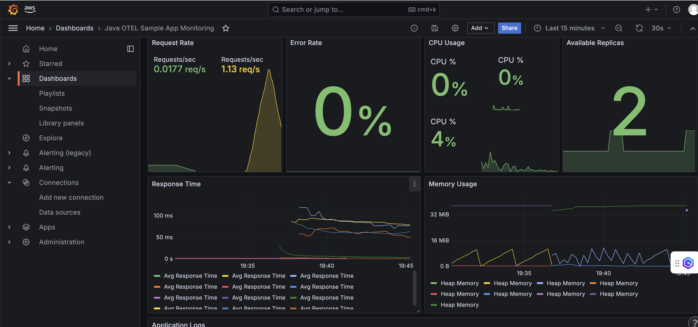

# Java OpenTelemetry Sample Application

A sample Java Spring Boot microservice instrumented with OpenTelemetry for distributed tracing and metrics collection.

## Features

- **Spring Boot REST API**: Microservice with multiple endpoints
- **OpenTelemetry Tracing**: Distributed tracing with OTLP export
- **Micrometer Metrics**: Prometheus metrics integration
- **System Monitoring**: CPU and memory usage metrics
- **Health Checks**: Actuator health endpoint for Kubernetes probes
- **Error Simulation**: 10% error rate for testing
- **Auto-scaling**: HPA with custom metrics support

## Endpoints

- `GET /health` - Health check endpoint
- `GET /api/users` - Users API endpoint with tracing
- `GET /api/products` - Products API endpoint with tracing
- `GET /actuator/prometheus` - Prometheus metrics endpoint

## Metrics Exported

### HTTP Metrics
- `http_requests_total` - Counter of HTTP requests by app
- `http_request_duration_seconds` - Histogram of request latencies

### System Metrics
- `java_cpu_usage_percent` - CPU usage percentage
- `java_memory_usage_bytes` - Memory usage in bytes

## Environment Variables

- `SERVER_PORT` - Server port (default: 8080)
- `OTEL_EXPORTER_OTLP_ENDPOINT` - OTLP endpoint
- `OTEL_SERVICE_NAME` - Service name for tracing
- `AWS_REGION` - AWS region for resource attributes
- `PROMETHEUS_WORKSPACE_ID` - Prometheus workspace ID
- `ENVIRONMENT` - Environment name for resource attributes

## Dependencies

- `Spring Boot 3.2.0` - Web framework and actuator
- `Micrometer Prometheus` - Metrics collection and export
- `OpenTelemetry SDK` - Distributed tracing
- `Jackson` - JSON processing

## Local Development

```bash
mvn clean package
java -jar target/java-otel-sample-app-1.0.jar
```

## Docker Build

```bash
docker build -t java-otel-sample-app .
docker run -p 8080:8080 java-otel-sample-app
```

## Kubernetes Deployment

```bash
chmod +x deploy-with-otel.sh
./deploy-with-otel.sh
```

## Testing

```bash
# Health check
curl http://localhost:8080/health

# API endpoints
curl http://localhost:8080/api/users
curl http://localhost:8080/api/products

# Metrics endpoint
curl http://localhost:8080/actuator/prometheus
```

## Grafana Dashboard



A pre-configured Grafana dashboard is available at `../grafana_dashboard/java-otel-app-dashboard.json`.